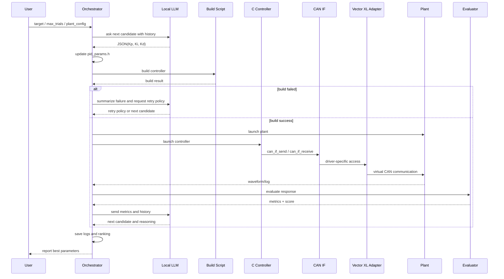
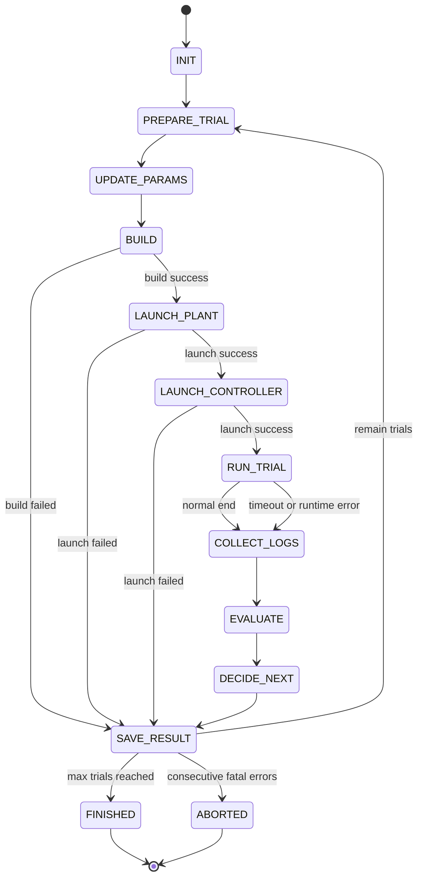

# PID係数自動適合システム 仕様書ドラフト

## 1. 目的

既存のPID制御コードに対して、ローカルLLMを用いてPID係数を自動調整し、指定した応答性能を満たす係数を探索・評価・更新する仕組みを定義する。

---

## 2. スコープ

本システムは以下を対象とする。

* 既存PID制御コードのうち、係数部分のみをローカルLLMが編集対象とする
* 編集後の制御コードをビルドし、プラントと接続して評価する
* プラントはPython製シミュレータとし、起動引数で動特性を切り替え可能とする
* 制御器とプラントの通信はCAN抽象I/F経由で扱う
* `stub` 実行ではアプリ内の仮想CANバスを使う
* `vector_xl` 実行では Vector XL Driver 経由の CAN チャネルを使う
* ローカルLLMが各試行結果を評価し、次のPID係数候補を決定する
* 指定回数に達した時点で探索を終了する

本仕様では、実機適用は対象外とし、まずは仮想CAN上の閉ループ評価を対象とする。

---

## 3. 前提条件

### 3.1 既存前提

* ローカルLLMの第一候補は `OpenVINO/Qwen3-8B-int4-ov` とする
* `OpenVINO/Qwen3-14B-int4-ov` は代替候補として利用可能
* `Qwen3-Coder-30B-A3B-Instruct-int4-ov` は将来候補として保持するが、MVP の標準構成からは外す
* Intel iGPU + OVMS 環境は構築済み
* Plan B として OpenAI API を利用する構成を想定し、モデル名は `gpt-5.4` を既定値として扱う
* 現行MVPではローカルLLMへの system / user prompt の既定言語は英語とし、`prompt_language` 設定で日本語へ切替可能とする
* `OpenVINO/Qwen3-8B-int4-ov + OVMS` では、英語 prompt の方が JSON 準拠と既出候補回避の安定性が高いものとして扱う
* ローカルLLMサーバはユーザーが事前起動し、オーケストレータは既存 endpoint に接続する
* controller の build / launch と plant の launch はオーケストレータが実行主体となる
* ユーザーは必要に応じて初回のみ追加方針を与えてよく、オーケストレータはそれを `Operator Intent` として内部 prompt に反映できる
* `Operator Intent` は PID範囲制約、重複禁止、JSONスキーマ、異常時fallbackなどの hard rule より優先しない
* 一方で `Operator Intent` は、recent history や既定ヒューリスティクスより優先される run 内方針として扱う
* `Operator Intent` は単なる参考意見ではなく、run 中に優先して従うべき方針として扱う
* `Operator Intent` が aggressive な探索、大きめの係数変更、初期オーバーシュート許容を求める場合、hard rule に反しない限り保守的な小変更へ勝手に弱めない
* 既定構成では trial 1 は `initial_pid` の評価とし、trial 2 以降で LLM 候補生成を使う
* コントローラ実装はC言語とする
* 開発・ビルド環境は Visual Studio 2017 Express を想定する
* PID制御コードは既存資産があり、係数定義部のみ差し替え可能
* ビルド手順は自動実行可能なコマンドとして整理済み、または整理可能
* Vector XL Driver 経由で仮想CAN通信が可能

### 3.2 制約

* ローカルLLMはPID係数以外の制御ロジックを書き換えない
* 評価はシミュレーション環境内で完結する
* 探索終了条件は「試行回数上限」とする
* CAN通信処理は抽象化レイヤーを介して実装し、後でマイコン実装のCANドライバへ差し替え可能とする
* リアルタイム性よりも、再現性と自動評価可能性を優先する

---

## 4. システム全体構成

## 4.1 構成要素

1. オーケストレータ

   * 全体の試行管理
   * LLMへのプロンプト生成
   * ビルド・実行・評価・ログ保存の統括

2. ローカルLLM

   * PID係数候補の生成
   * 既存コードの係数部分の編集
   * 試行結果の解釈
   * 次回候補の判断

3. PID制御器

   * 既存コードベース
   * CAN経由で目標値・制御量・観測値を送受信
   * 編集対象は PID係数 `Kp, Ki, Kd` のみ

4. プラントシミュレータ

   * Python実装
   * 一次遅れ、二次遅れ、無駄時間、ノイズ、非線形切替要素を持つ
   * 起動引数により複数要素を組み合わせ可能

5. 通信層

   * CAN抽象化レイヤーとVector XL Driverアダプタで構成する
   * `stub` 実行ではアプリ内仮想CANバス上で制御器とプラントを接続する
   * `vector_xl` 実行では Vector XL Driver 経由の CAN チャネルを用いる
   * 将来、同一抽象APIのままマイコン側CANドライバへ差し替え可能とする

6. 評価器

   * 応答波形から性能指標を算出
   * 目標性能との適合度をスコア化

7. 成果物管理

   * 各試行の係数、ビルド結果、実行ログ、波形、評価値、LLM判断理由を保存

---

## 5. ユースケース

### 5.1 基本ユースケース

1. ユーザーが目標応答性能と試行回数上限を指定する
2. オーケストレータが初期PID候補群を用意する
3. ローカルLLMが候補を選択し、既存コードの係数を編集する
4. 制御コードをビルドする
5. PID制御器とプラントシミュレータを起動する
6. 仮想CAN上で閉ループ制御を実行する
7. 評価器が応答性能指標を算出する
8. ローカルLLMが結果を解釈して次の係数候補を決める
9. 指定回数に達するまで繰り返す
10. 最良係数と探索履歴を出力する

---

## 6. 機能要件

### 6.1 係数編集機能

* 既存C言語PIDコードの係数定義箇所を特定し、`Kp`, `Ki`, `Kd` を差し替えられること
* 係数編集対象をテンプレート化し、誤って制御ロジック本体を変更しないこと
* 編集後コードとの差分を保存すること

### 6.2 ビルド機能

* 編集後のC言語コントローラコードを Visual Studio 2017 Express 想定のビルド手順で自動ビルドできること
* `msbuild` などのコマンドライン起動を前提に自動化できること
* ビルド成否、警告、エラー内容を保存すること
* ビルド失敗時はその候補を失敗扱いとして次候補へ進めること

### 6.3 プラント起動機能

* プラントシミュレータは以下の要素を組み合わせ可能とする

  * 一次遅れ
  * 二次遅れ
  * 無駄時間
  * ノイズ
  * `tanh` などによる急峻な非線形切替
* 各要素は起動引数で有効・無効およびパラメータ設定できること

### 6.4 閉ループ実行機能

* PID制御器とプラントシミュレータをローカルLLMまたはオーケストレータが起動できること
* 仮想CANバス上で設定値、観測値、操作量をやり取りできること
* CAN送受信は抽象化レイヤー経由で呼び出されること
* Vector XL Driver依存部はアダプタ層へ閉じ込め、制御ロジック本体と分離すること
* ステップ応答試験を最低限サポートすること

### 6.5 評価機能

* 各試行に対して以下の応答性能指標を算出すること

  * 立ち上がり時間
  * 整定時間
  * オーバーシュート率
  * 定常偏差
  * IAE
  * ISE
  * ITAE
  * 操作量変動量
  * 振動有無
  * 発散有無
* 目標性能との乖離から総合スコアを算出すること

### 6.6 探索制御機能

* 指定試行回数まで探索を実行すること
* 過去結果に基づき次の係数候補を更新すること
* 最良スコアの候補を常に保持すること
* 重複候補の再試行を抑制すること
* 全制約を満たした候補が存在するかどうかを明示できること

### 6.7 ログ・レポート機能

* 各試行ごとに以下を保存すること

  * 試行番号
  * PID係数
  * 編集差分
  * ビルド結果
  * 実行コマンド
  * プラント条件
  * 応答波形
  * 評価指標
  * 総合スコア
  * LLMの判断理由
* 最終的に最良候補一覧と探索履歴を出力すること
* ranking には PID係数と制約達成状況を含め、全制約達成候補が未発見の場合はその旨を明示すること

---

## 7. 非機能要件

### 7.1 再現性

* 同一係数、同一プラント条件、同一乱数シードで同一結果が再現できること

### 7.2 安全性

* PID係数の探索範囲に上限・下限を設けること
* 明らかな不安定候補を早期打ち切りできること
* 操作量飽和や異常発散時は即時停止できること

### 7.3 保守性

* プラント要素追加や評価指標追加が容易な構造とすること
* LLMプロンプト、ビルド手順、評価関数を分離すること

### 7.4 監査性

* どの係数がどの理由で選ばれたか追跡可能であること
* LLMの判断入力と出力を保存すること

---

## 8. プラント仕様

### 8.1 基本モデル

プラントは以下の要素を単独または複合で構成する。

1. 一次遅れ系

   * 例: $G(s)=\frac{K}{Ts+1}$

2. 二次遅れ系

   * 例: $G(s)=\frac{\omega_n^2}{s^2+2\zeta\omega_n s+\omega_n^2}$

3. 無駄時間

   * 例: $e^{-Ls}$

4. ノイズ付加

   * 白色雑音、ガウス雑音など

5. 非線形切替

   * `tanh(ax)` によるゲイン変化
   * 閾値近傍の急峻切替

### 8.2 起動引数例

```bash
python plant.py \
  --plant first_order \
  --gain 1.0 \
  --tau 0.8 \
  --deadtime 0.1 \
  --noise gaussian:0.01 \
  --nonlinear tanh:5.0
```

### 8.3 組み合わせ例

* 一次遅れ + ノイズ
* 一次遅れ + 無駄時間
* 二次遅れ + 無駄時間 + ノイズ
* 二次遅れ + `tanh` 非線形
* 一次遅れ + 二次遅れ相当のカスケード

---

## 9. 応答性能仕様

### 9.1 目標性能入力

ユーザーは以下のような目標応答性能を指定できる。

* 立ち上がり時間: 1.0秒以下
* 整定時間: 2.5秒以下
* オーバーシュート: 5%以下
* 定常偏差: 1%以下
* 振動なし
* 操作量の急変抑制

### 9.2 総合評価スコア

各指標を正規化し、重み付き和で総合スコアを算出する。

例:
$$
J = w_1 J_{rise} + w_2 J_{settling} + w_3 J_{overshoot} + w_4 J_{ss} + w_5 J_{IAE} + w_6 J_{u}
$$

スコアは小さいほど良いものとする。

### 9.3 失敗判定

以下は失敗試行とする。

* ビルド失敗
* CAN通信初期化失敗
* プラントまたは制御器の起動失敗
* 応答が発散
* 整定条件未達
* 異常振動継続
* 操作量飽和継続

---

## 10. LLMによる探索ロジック

### 10.1 基本方針

ローカルLLMは試行結果を読み取り、次のPID係数候補を決定する。

探索は以下の二段階を推奨する。

1. 粗探索

   * 広い範囲で候補を列挙し、安定で有望な領域を見つける

2. 精密探索

   * 有望領域の近傍で刻み幅を細かくし、目標性能に近づける

### 10.2 LLMへの入力

* 現在までの試行履歴
* 直近の応答波形要約
* 各性能指標
* 最良候補とそのスコア
* 次候補生成ルール

### 10.3 LLMの出力

* 次試行の `Kp`, `Ki`, `Kd`
* 候補選定理由
* 予想する応答変化
* 必要なら探索モード切替指示（粗探索→精密探索）

### 10.4 ガードレール

* 係数範囲外の出力は無効
* 同一候補の繰り返しは不可
* 連続失敗時は変化量を縮小または探索点を戻す
* LLMの出力形式は原則JSON固定とし、自由記述を最小化する
* explanation とは別に、観測問題、各係数の操作意図、想定トレードオフ、リスクを持つ構造化 rationale を保存できること
* `Operator Intent` が存在する場合、explanation と rationale.expected_tradeoff に「どう反映したか」を短く含められること
* LLMはPID係数以外のCソースを書き換えない
* LLMはビルド失敗時にコンパイラエラーの原因箇所を確認しても、原則として係数定義部以外の修正提案を行わない

### 10.5 LLMへの指示設計方針

ローカルLLMには、役割ごとに指示を分けて与える。

1. 候補生成指示

   * 次に試す `Kp`, `Ki`, `Kd` を決める

2. コード編集指示

   * 指定係数を既存Cコードの係数定義部へ反映する

3. 結果評価指示

   * 応答性能と失敗内容を読み、次の探索方針を決める

4. 例外時指示

   * ビルド失敗、実行失敗、発散時の扱いを決める

LLMには毎回フルコンテキストを渡すのではなく、以下の要約情報を与える。

* 現在の試行番号 / 残試行数
* 直近数回の結果
* 現時点の最良候補
* 今回のプラント条件
* 係数許容範囲
* 出力フォーマット制約

### 10.6 LLMへのシステム指示例

以下はローカルLLMに固定で与えるシステム指示の例である。

```text
あなたはPID自動適合用のローカル最適化エージェントである。
目的は、既存のC言語PIDコントローラの係数 Kp, Ki, Kd のみを調整し、指定された応答性能目標を満たすことである。

守るべき制約:
- 変更してよいのはPID係数のみ
- Cコードの制御ロジック本体、CAN抽象化I/F、状態遷移、関数構造は変更しない
- 出力は必ず指定JSON形式に従う
- 候補は係数範囲内のみとする
- 過去に試行済みの候補は再提案しない
- ビルド失敗時も、原則として係数以外の変更提案はしない
- 発散や異常振動が出た場合は、安定化を優先した候補を提案する

探索方針:
- 初期段階は粗探索を行う
- 有望領域が見えたら近傍探索へ移行する
- 立ち上がりが遅ければ Kp を上げることを優先する
- 定常偏差が大きければ Ki を上げることを検討する
- オーバーシュートや振動が大きければ Kp を下げる、または Kd を上げることを検討する
- ノイズ感度が高ければ Kd を下げる方向も検討する

評価対象:
- 立ち上がり時間
- 整定時間
- オーバーシュート
- 定常偏差
- IAE / ISE / ITAE
- 操作量変動
- 発散有無
- 振動有無

目的関数は総合スコア最小化である。
```

### 10.7 LLMへの内部 prompt 例

本仕様で示す自然言語例は、ユーザーが各 trial ごとに手入力する指示ではない。
ユーザーは主に設定ファイルと CLI 引数で目標条件を与え、オーケストレータが各 trial の状態をまとめて内部 prompt を生成する。
初回の追加方針は `--user-instruction` 相当で一度だけ与えてよく、run 中は `Operator Intent` として扱う。
`Operator Intent` は hard rule を上書きしないが、recent history や既定ヒューリスティクスより優先して解釈させる。
trial 1 の `initial_pid` 評価そのものは既定探索パターンを優先する。

#### 10.7.1 次候補生成の内部 prompt 例

```text
以下はPID自動適合の現在状態である。次に試す PID 係数候補を1件だけ提案せよ。

[目標応答性能]
- rise_time <= 1.0
- settling_time <= 2.5
- overshoot <= 5.0
- steady_state_error <= 0.01
- no_sustained_oscillation = true

[係数許容範囲]
- Kp: 0.01 ~ 10.0
- Ki: 0.00 ~ 5.0
- Kd: 0.00 ~ 2.0

[プラント条件]
- plant = second_order
- wn = 4.0
- zeta = 0.4
- deadtime = 0.10
- noise = gaussian:0.01
- nonlinear = tanh:4.0

[現在の最良候補]
- Kp = 1.20
- Ki = 0.35
- Kd = 0.08
- score = 0.412

[Operator Intent]
- Start with an intentionally aggressive candidate.
- Allow initial overshoot, then gradually stabilize in later trials.
- Do not stay conservative in early trials.

[Operator Intent Priority]
- Treat Operator Intent as a run contract, not as a weak suggestion.
- Follow Operator Intent unless it conflicts with hard safety constraints, JSON schema, PID limits, or duplicate-candidate prohibition.
- If Operator Intent conflicts with recent-history heuristics, prefer Operator Intent.
- Do not silently soften it into a conservative move.
- If it asks for aggressive exploration or a larger parameter swing, make a meaningfully stronger move unless a hard constraint blocks it.

[直近の試行結果]
1) Kp=1.20 Ki=0.35 Kd=0.08
   rise=0.92 settling=3.40 overshoot=12.0 sse=0.004 oscillation=true score=0.412
2) Kp=0.95 Ki=0.30 Kd=0.10
   rise=1.20 settling=2.90 overshoot=4.5 sse=0.010 oscillation=false score=0.438
3) Kp=1.40 Ki=0.35 Kd=0.12
   rise=0.70 settling=4.20 overshoot=18.0 sse=0.003 oscillation=true score=0.603

[出力要件]
- JSONのみを返す
- explanation は100文字以内
- mode は coarse または fine
- Operator Intent がある場合、explanation にはその意図をどう反映したかを短く含める
- Operator Intent がある場合、rationale.expected_tradeoff にもその意図を反映する
- Operator Intent が aggressive な探索や大きめの係数変更を求める場合、小さな無難調整ではなく意味のある係数変更を優先する

出力形式:
{
  "mode": "fine",
  "next_candidate": {
    "Kp": 0.0,
    "Ki": 0.0,
    "Kd": 0.0
  },
  "expectation": "overshoot_down",
  "explanation": "...",
  "rationale": {
    "observed_issue": "...",
    "parameter_actions": {
      "Kp": "increase|decrease|keep",
      "Ki": "increase|decrease|keep",
      "Kd": "increase|decrease|keep"
    },
    "expected_tradeoff": "...",
    "risk": "..."
  }
}
```

#### 10.7.2 コード編集の指示例

```text
以下のCヘッダファイルに対して、PID係数定義のみを書き換えよ。
それ以外の行は変更しないこと。
返答は更新後ファイル全文のみとする。

[更新対象]
- Kp = 0.95
- Ki = 0.30
- Kd = 0.10

[対象ファイル]
#ifndef PID_PARAMS_H
#define PID_PARAMS_H

#define PID_KP (1.20)
#define PID_KI (0.35)
#define PID_KD (0.08)

#endif
```

#### 10.7.3 結果評価と次方針決定の指示例

```text
以下の試行結果を評価し、次は Kp, Ki, Kd のどれを主に増減すべきか判断せよ。
JSONのみ返すこと。

[目標]
- rise_time <= 1.0
- settling_time <= 2.5
- overshoot <= 5.0
- steady_state_error <= 0.01

[今回結果]
- Kp = 1.20
- Ki = 0.35
- Kd = 0.08
- rise_time = 0.92
- settling_time = 3.40
- overshoot = 12.0
- steady_state_error = 0.004
- oscillation = true
- control_variation = high

出力形式:
{
  "dominant_issue": "overshoot_and_oscillation",
  "adjust_priority": ["Kd_up", "Kp_down", "Ki_down"],
  "reason": "overshootと振動が支配的で、まず減衰を増やす必要がある"
}
```

#### 10.7.4 ビルド失敗時の指示例

```text
以下はPID係数更新後のビルド結果である。
ビルド失敗の原因が係数埋め込み書式にあるかどうかを判定し、次に再試行すべき係数候補を返せ。
Cロジック本体の修正提案は禁止する。
JSONのみ返すこと。

[build log]
error C2059: syntax error: ')'
error C2143: syntax error: missing ';' before 'constant'

[直前に埋め込んだ係数]
- Kp = 1.20
- Ki = 0.35
- Kd = 0.08

出力形式:
{
  "cause": "format_error_or_embedding_error",
  "retry_with_same_candidate": true,
  "next_candidate": {
    "Kp": 1.20,
    "Ki": 0.35,
    "Kd": 0.08
  },
  "instruction": "係数文字列の埋め込み形式だけを見直す"
}
```

### 10.8 LLM出力の推奨JSONスキーマ

LLMの出力は固定スキーマに寄せる。初版では以下を推奨する。

#### 候補生成用スキーマ

```json
{
  "mode": "coarse",
  "next_candidate": {
    "Kp": 1.0,
    "Ki": 0.2,
    "Kd": 0.05
  },
  "expectation": "rise_up_overshoot_down",
  "explanation": "Kdを少し上げて減衰を増やしつつKpを少し下げる",
  "rationale": {
    "observed_issue": "overshoot_and_oscillation",
    "parameter_actions": {
      "Kp": "decrease",
      "Ki": "keep",
      "Kd": "increase"
    },
    "expected_tradeoff": "減衰は増えるがノイズ感度が上がる可能性がある",
    "risk": "noise_sensitivity"
  }
}
```

#### 結果評価用スキーマ

```json
{
  "dominant_issue": "settling_too_long",
  "adjust_priority": ["Kp_up", "Ki_up"],
  "reason": "立ち上がりと定常偏差の改善余地があり、減衰不足は支配的ではない"
}
```

#### 異常系判定用スキーマ

```json
{
  "trial_status": "failed",
  "failure_type": "divergence",
  "retry_policy": "change_direction",
  "suggested_action": ["Kp_down", "Ki_down", "Kd_up"]
}
```

---

## 11. PID係数候補パターン列挙

本仕様では、LLMが自由生成する前に、候補の母集団として以下のパターンを定義する。

### 11.1 初期ベース候補

既存値または基準値を以下とする。

* ベース値: $(Kp_0, Ki_0, Kd_0)$

### 11.2 単軸変更パターン

1. `Kp` のみ変更

   * $(0.5Kp_0, Ki_0, Kd_0)$
   * $(0.8Kp_0, Ki_0, Kd_0)$
   * $(1.2Kp_0, Ki_0, Kd_0)$
   * $(1.5Kp_0, Ki_0, Kd_0)$
   * $(2.0Kp_0, Ki_0, Kd_0)$

2. `Ki` のみ変更

   * $(Kp_0, 0.5Ki_0, Kd_0)$
   * $(Kp_0, 0.8Ki_0, Kd_0)$
   * $(Kp_0, 1.2Ki_0, Kd_0)$
   * $(Kp_0, 1.5Ki_0, Kd_0)$
   * $(Kp_0, 2.0Ki_0, Kd_0)$

3. `Kd` のみ変更

   * $(Kp_0, Ki_0, 0.5Kd_0)$
   * $(Kp_0, Ki_0, 0.8Kd_0)$
   * $(Kp_0, Ki_0, 1.2Kd_0)$
   * $(Kp_0, Ki_0, 1.5Kd_0)$
   * $(Kp_0, Ki_0, 2.0Kd_0)$

### 11.3 二軸連動パターン

1. `Kp` 増、`Ki` 増

   * $(1.2Kp_0, 1.2Ki_0, Kd_0)$
   * $(1.5Kp_0, 1.5Ki_0, Kd_0)$

2. `Kp` 増、`Kd` 増

   * $(1.2Kp_0, Ki_0, 1.2Kd_0)$
   * $(1.5Kp_0, Ki_0, 1.5Kd_0)$

3. `Kp` 増、`Ki` 減

   * $(1.2Kp_0, 0.8Ki_0, Kd_0)$
   * $(1.5Kp_0, 0.5Ki_0, Kd_0)$

4. `Kp` 増、`Kd` 減

   * $(1.2Kp_0, Ki_0, 0.8Kd_0)$
   * $(1.5Kp_0, Ki_0, 0.5Kd_0)$

5. `Ki` 増、`Kd` 増

   * $(Kp_0, 1.2Ki_0, 1.2Kd_0)$
   * $(Kp_0, 1.5Ki_0, 1.5Kd_0)$

### 11.4 三軸一括変更パターン

* $(0.8Kp_0, 0.8Ki_0, 0.8Kd_0)$
* $(1.2Kp_0, 1.2Ki_0, 1.2Kd_0)$
* $(1.5Kp_0, 1.5Ki_0, 1.5Kd_0)$

### 11.5 探索半径ベース近傍候補

最良候補 $(Kp_b, Ki_b, Kd_b)$ に対し、以下の近傍探索を行う。

* $(Kp_b \pm \Delta_p, Ki_b, Kd_b)$
* $(Kp_b, Ki_b \pm \Delta_i, Kd_b)$
* $(Kp_b, Ki_b, Kd_b \pm \Delta_d)$
* $(Kp_b \pm \Delta_p, Ki_b \pm \Delta_i, Kd_b)$
* $(Kp_b \pm \Delta_p, Ki_b, Kd_b \pm \Delta_d)$
* $(Kp_b, Ki_b \pm \Delta_i, Kd_b \pm \Delta_d)$
* $(Kp_b \pm \Delta_p, Ki_b \pm \Delta_i, Kd_b \pm \Delta_d)$

ここで $\Delta_p, \Delta_i, \Delta_d$ は探索段階に応じて縮小する。

### 11.6 ログスケール候補

初期粗探索では桁違いの候補も許容する。

* $Kp \in {0.1, 0.3, 1, 3, 10} \times Kp_0$
* $Ki \in {0.1, 0.3, 1, 3, 10} \times Ki_0$
* $Kd \in {0.1, 0.3, 1, 3, 10} \times Kd_0$

全組合せは多すぎるため、以下の方法で間引く。

* 単軸優先
* 二軸連動の代表点のみ抽出
* 前回失敗領域の近傍を除外

### 11.7 ヒューリスティック候補生成ルール

LLMは以下の経験則を使って候補を提案してよい。

1. 立ち上がりが遅い

   * `Kp` を上げる
   * 必要に応じて `Ki` を少し上げる

2. オーバーシュートが大きい

   * `Kp` を下げる
   * `Kd` を上げる
   * `Ki` を下げる

3. 定常偏差が残る

   * `Ki` を上げる

4. ノイズに敏感

   * `Kd` を下げる
   * フィルタ導入は将来拡張とする

5. 振動しやすい

   * `Kp` を下げる
   * `Ki` を下げる
   * `Kd` を上げる

---

## 12. 探索アルゴリズム案

### 12.1 推奨アルゴリズム

1. 初期候補群列挙
2. 各候補を評価
3. 上位N件を保持
4. 上位候補の近傍をLLMが生成
5. 近傍候補を再評価
6. 指定回数まで反復

### 12.2 実装しやすい探索方式

* ルールベース + LLM判断
* 座標降下法風探索
* ランダム近傍探索
* coarse-to-fine 探索

初版では「ルールベース + LLM判断 + 近傍探索」の組み合わせを推奨する。

---

## 13. 状態遷移

1. 初期化
2. 候補生成
3. コード編集
4. ビルド
5. 実行
6. 評価
7. 履歴更新
8. 終了判定
9. 未終了なら候補生成へ戻る
10. 終了なら結果出力

---

## 14. 入出力仕様

### 14.1 入力

* 目標応答性能
* 試行回数上限
* 初期PID係数
* 係数上下限
* プラント構成引数
* 評価重み
* 乱数シード

### 14.2 出力

* 最良PID係数
* 最良試行の評価結果
* 全試行履歴
* 応答波形ログ
* 失敗試行一覧
* LLM判断ログ

---

## 15. 異常系

* 係数編集対象が見つからない
* ビルド失敗
* CAN初期化失敗
* 制御器起動失敗
* プラント起動失敗
* タイムアウト
* 波形取得失敗
* LLM応答形式不正

各異常は試行単位でハンドリングし、システム全体を停止させないことを基本とする。ただし連続異常が閾値を超えた場合は停止する。

---

## 16. 受け入れ基準

1. 指定回数の探索を自動完走できる
2. 既存PIDコードの係数部分のみ差し替えできる
3. 仮想CANを介した閉ループ実行ができる
4. 指定したプラント構成で試験できる
5. 各試行の評価指標を保存できる
6. 最良係数をランキング形式で出力できる
7. 少なくとも1つの目標応答性能ケースで初期値より改善を示せる

---

## 17. 実装時の推奨ディレクトリ構成

```text
project/
├─ orchestrator/                      # 試行全体を統括するPythonオーケストレータ群
│  ├─ main.py                         # 実行エントリ / 全体制御
│  ├─ tuner.py                        # 探索ループ管理 / 最良候補更新
│  ├─ evaluator.py                    # 応答波形の評価指標算出
│  ├─ prompt_builder.py               # LLM入力プロンプト生成
│  └─ candidate_generator.py          # 初期候補列挙 / 近傍候補生成
├─ controller/                        # C言語PIDコントローラ本体
│  ├─ src/                            # 制御ロジック / アプリ本体ソース
│  │  ├─ controller_main.c            # 制御器メインエントリ
│  │  ├─ pid_controller.c             # PID演算本体
│  │  ├─ control_loop.c               # 周期実行 / 状態更新
│  │  ├─ can_if_vector_xl.c           # Vector XL Driver接続アダプタ
│  │  └─ can_if_mcu_stub.c            # 将来のマイコンCAN差し替え用スタブ
│  ├─ include/                        # 公開ヘッダ / インターフェース定義
│  │  ├─ pid_controller.h             # PID演算API
│  │  ├─ pid_params.h                 # PID係数定義ヘッダ
│  │  ├─ control_loop.h               # 制御周期処理API
│  │  └─ can_if.h                     # CAN抽象化インターフェース
│  ├─ vs2017/                         # Visual Studio 2017 Expressプロジェクト定義
│  │  ├─ controller.sln               # ソリューション定義
│  │  └─ controller.vcxproj           # Cコントローラ用プロジェクト定義
│  └─ build/                          # ビルド生成物出力先
├─ plant/                             # Python製プラントシミュレータ
│  ├─ plant.py                        # プラント起動エントリ
│  ├─ models/                         # 動特性モデル群
│  │  ├─ first_order.py               # 一次遅れモデル
│  │  ├─ second_order.py              # 二次遅れモデル
│  │  ├─ deadtime.py                  # 無駄時間モデル
│  │  ├─ noise.py                     # ノイズ付加モデル
│  │  └─ nonlinear.py                 # tanh等の非線形モデル
│  └─ can_io.py                       # 仮想CAN通信用I/O処理
├─ configs/                           # 実行条件設定ファイル群
│  ├─ target_response.yaml            # 目標応答性能定義
│  ├─ plant_cases.yaml                # プラント条件定義
│  └─ limits.yaml                     # PID係数範囲 / 異常停止条件
├─ logs/                              # 各試行ログ / 標準出力 / エラーログ
├─ results/                           # 波形 / 評価結果 / 最終ランキング
└─ scripts/                           # 実行補助スクリプト
   ├─ build_controller.bat            # VS2017 Express向けビルド実行
   ├─ run_trial.bat                   # 単回試行実行
   └─ clean.bat                       # 生成物クリーンアップ
```

---

## 17.1 `can_if.h` のI/F仕様

### 17.1.1 目的

`can_if.h` は、コントローラ本体からCAN依存実装を分離するための抽象化インターフェースである。

本I/Fの目的は以下の通り。

* PID制御ロジックから Vector XL Driver 依存を排除する
* 将来、マイコン実装のCANドライバへ差し替え可能にする
* 上位の制御コードは同一APIで送受信できるようにする

### 17.1.2 設計方針

* `can_if.h` はプラットフォーム非依存の型と関数宣言のみを持つ
* Vector XL 固有の型やヘッダは `can_if_vector_xl.c` のみに閉じ込める
* 将来のマイコン向け実装は `can_if_mcu.c` などで差し替える
* PID制御器本体は `can_if.h` だけを `include` する
* 送受信フレーム形式は標準CANを基本とし、必要なら拡張ID対応を可能にする

### 17.1.3 想定責務

`can_if.h` が提供する責務は以下とする。

* CAN初期化
* CANオープン
* CANクローズ
* CAN送信
* CAN受信
* 時刻取得補助
* エラー状態取得

### 17.1.4 ヘッダ仕様案

```c
#ifndef CAN_IF_H
#define CAN_IF_H

#include <stdint.h>
#include <stddef.h>

#ifdef __cplusplus
extern "C" {
#endif

typedef enum
{
    CAN_IF_OK = 0,
    CAN_IF_ERROR = -1,
    CAN_IF_TIMEOUT = -2,
    CAN_IF_INVALID_ARG = -3,
    CAN_IF_NOT_OPEN = -4,
    CAN_IF_HW_ERROR = -5
} can_if_status_t;

typedef enum
{
    CAN_IF_ID_STANDARD = 0,
    CAN_IF_ID_EXTENDED = 1
} can_if_id_type_t;

typedef struct
{
    uint32_t id;
    can_if_id_type_t id_type;
    uint8_t dlc;
    uint8_t data[8];
    uint32_t timestamp_ms;
} can_if_frame_t;

typedef struct
{
    uint32_t channel_index;
    uint32_t bitrate;
    uint32_t rx_timeout_ms;
} can_if_config_t;

typedef struct can_if_handle_tag can_if_handle_t;

can_if_status_t can_if_init(can_if_handle_t **handle, const can_if_config_t *config);
can_if_status_t can_if_open(can_if_handle_t *handle);
can_if_status_t can_if_close(can_if_handle_t *handle);
can_if_status_t can_if_deinit(can_if_handle_t *handle);

can_if_status_t can_if_send(can_if_handle_t *handle, const can_if_frame_t *frame);
can_if_status_t can_if_receive(can_if_handle_t *handle, can_if_frame_t *frame, uint32_t timeout_ms);

can_if_status_t can_if_get_last_error(can_if_handle_t *handle, int32_t *error_code);
uint32_t can_if_get_time_ms(void);

#ifdef __cplusplus
}
#endif

#endif
```

### 17.1.5 各APIの役割

| API                     | 役割                | 備考             |
| ----------------------- | ----------------- | -------------- |
| `can_if_init`           | ハンドル生成と設定値反映      | 実装依存リソース確保     |
| `can_if_open`           | CANチャネルを通信可能状態にする | Vector XL 接続開始 |
| `can_if_close`          | CANチャネルを閉じる       | 実行終了時に呼ぶ       |
| `can_if_deinit`         | ハンドル破棄            | メモリ解放を含む       |
| `can_if_send`           | 1フレーム送信           | 制御量や目標値送信用     |
| `can_if_receive`        | 1フレーム受信           | 観測値受信用         |
| `can_if_get_last_error` | 実装依存エラー取得         | ログ・異常解析用       |
| `can_if_get_time_ms`    | 時刻取得              | タイムスタンプ付与用     |

### 17.1.6 実装分離ルール

* `controller_main.c`, `control_loop.c`, `pid_controller.c` は `can_if.h` のみ参照する
* `can_if_vector_xl.c` が Vector XL Driver API を吸収する
* `can_if_mcu_stub.c` は将来のマイコン移植時の差し替え土台とする
* CAN ID、周期、DLC、信号レイアウトは別途 `can_map.h` 等へ分離してもよい

### 17.1.7 推奨メッセージ例

初版では以下のような役割分担を想定する。

| 用途    | CAN ID例 | 内容             |
| ----- | ------- | -------------- |
| 目標値送信 | `0x100` | setpoint       |
| 観測値受信 | `0x101` | measurement    |
| 操作量送信 | `0x102` | control output |
| 状態通知  | `0x103` | error/status   |

### 17.1.8 使用例

```c
can_if_handle_t *can_handle = NULL;
can_if_config_t config;
can_if_frame_t tx_frame;
can_if_frame_t rx_frame;

config.channel_index = 0U;
config.bitrate = 500000U;
config.rx_timeout_ms = 20U;

if (can_if_init(&can_handle, &config) != CAN_IF_OK)
{
    return -1;
}

if (can_if_open(can_handle) != CAN_IF_OK)
{
    can_if_deinit(can_handle);
    return -1;
}

tx_frame.id = 0x102U;
tx_frame.id_type = CAN_IF_ID_STANDARD;
tx_frame.dlc = 4U;
tx_frame.data[0] = 0x11U;
tx_frame.data[1] = 0x22U;
tx_frame.data[2] = 0x33U;
tx_frame.data[3] = 0x44U;

(void)can_if_send(can_handle, &tx_frame);
(void)can_if_receive(can_handle, &rx_frame, 20U);

(void)can_if_close(can_handle);
(void)can_if_deinit(can_handle);
```

## 17.2 `pid_params.h` の編集対象テンプレート

### 17.2.1 目的

ローカルLLMが安全に編集できるよう、PID係数定義を単独ヘッダへ隔離する。
これにより、LLMが変更してよい範囲を明確化し、制御ロジック本体の誤改変を防ぐ。

### 17.2.2 設計ルール

* LLMの編集対象は `pid_params.h` のみとする
* 編集対象は `PID_KP`, `PID_KI`, `PID_KD` の3定義のみとする
* コメント、ガードマクロ、他定義の変更は禁止する
* 数値は小数表記で埋め込む
* 書式崩れによるビルド失敗を避けるため、テンプレート固定とする

### 17.2.3 推奨テンプレート

```c
#ifndef PID_PARAMS_H
#define PID_PARAMS_H

/*
 * Auto-generated target:
 * Only PID_KP, PID_KI, PID_KD are editable by local LLM.
 * Do not modify other lines.
 */

#define PID_KP    (1.200000)
#define PID_KI    (0.350000)
#define PID_KD    (0.080000)

#endif /* PID_PARAMS_H */
```

### 17.2.4 編集対象マーキング付きテンプレート

LLMにより厳密に編集させたい場合は、編集許可範囲を明示したテンプレートを使う。

```c
#ifndef PID_PARAMS_H
#define PID_PARAMS_H

/* AUTO_EDIT_BEGIN: PID_PARAMS */
#define PID_KP    (1.200000)
#define PID_KI    (0.350000)
#define PID_KD    (0.080000)
/* AUTO_EDIT_END: PID_PARAMS */

#endif /* PID_PARAMS_H */
```

### 17.2.5 オーケストレータ側の更新ルール

* 原則としてLLMに全文生成させるより、オーケストレータが数値置換する方式を優先する
* LLMには候補係数のみをJSONで返させ、`pid_params.h` 更新はPython側で行ってもよい
* どうしてもLLMにヘッダ全文を書かせる場合は、テンプレート一致検査を行う
* 差分検査で `PID_KP`, `PID_KI`, `PID_KD` 以外の変更があれば失敗扱いにする

### 17.2.6 差し替え対象の正規表現例

```text
^#define\s+PID_KP\s+\([^)]+\)$
^#define\s+PID_KI\s+\([^)]+\)$
^#define\s+PID_KD\s+\([^)]+\)$
```

### 17.2.7 LLMへの編集指示例

```text
以下の `pid_params.h` に対して、AUTO_EDIT_BEGIN と AUTO_EDIT_END の間だけを書き換えよ。
それ以外の行は絶対に変更しないこと。
数値は小数6桁で出力すること。
返答は更新後ファイル全文のみとする。

更新値:
- PID_KP = 0.950000
- PID_KI = 0.300000
- PID_KD = 0.100000
```

## 17.3 オーケストレータとLLMのシーケンス図

### 17.3.1 シーケンス概要

オーケストレータは、候補生成、コード反映、ビルド、実行、評価、次候補判断を一貫して管理する。
LLMは主に「候補提案」と「結果解釈」を担当し、実行主体はオーケストレータとする。

### 17.3.2 基本シーケンス

```text
ユーザー
  -> オーケストレータ : 目標応答性能 / 試行回数 / プラント条件を指定
オーケストレータ
  -> 候補生成器 : 初期候補群を準備
オーケストレータ
  -> ローカルLLM : 直近履歴と目標を渡して次候補を問い合わせ
ローカルLLM
  -> オーケストレータ : 次候補(Kp, Ki, Kd)をJSONで返す
オーケストレータ
  -> pid_params.h : 係数を書き換える
オーケストレータ
  -> ビルドスクリプト : VS2017 Express想定でビルド実行
ビルドスクリプト
  -> オーケストレータ : ビルド結果を返す

alt ビルド失敗
  オーケストレータ
    -> ローカルLLM : 失敗要約と直前候補を渡して再判断要求
  ローカルLLM
    -> オーケストレータ : 再試行方針または次候補を返す
else ビルド成功
  オーケストレータ
    -> プラント : Pythonプラント起動
  オーケストレータ
    -> コントローラ : Cコントローラ起動
  コントローラ
    -> CAN抽象I/F : can_if_send / can_if_receive
  CAN抽象I/F
    -> Vector XLアダプタ : 仮想CANへ接続
  Vector XLアダプタ
    <-> プラント : setpoint / measurement / control output を送受信
  プラント
    -> オーケストレータ : 波形ログ / 実行ログ返却
  オーケストレータ
    -> 評価器 : 応答性能指標を計算依頼
  評価器
    -> オーケストレータ : score と指標一覧を返す
  オーケストレータ
    -> ローカルLLM : 評価結果と履歴を渡して次方針を問い合わせ
  ローカルLLM
    -> オーケストレータ : 次候補と理由を返す
end

オーケストレータ
  -> 結果保存 : ログ、波形、評価値、判断理由を保存
オーケストレータ
  -> ユーザー : 最良候補と履歴を出力
```

### 17.3.3 Mermaid記法例



### 17.3.4 実装上の責務分離

* オーケストレータは状態管理、試行制御、ログ保存を担う
* LLMは候補提案と結果解釈のみを担う
* `pid_params.h` 更新は、可能ならオーケストレータ側で機械的に行う
* `can_if.h` は通信の抽象化境界であり、コントローラ本体は下位実装を知らない
* プラントと評価器はPython側に分離し、Cコントローラとは疎結合に保つ

## 17.4 `can_map.h` の信号定義案

### 17.4.1 目的

`can_map.h` は、コントローラとプラント間でやり取りするCANメッセージのID、ペイロード割り当て、スケーリングを定義するためのヘッダである。

目的は以下の通り。

* 制御ロジックと通信レイアウトを分離する
* CAN IDやペイロード構造の変更影響を局所化する
* 将来のマイコンCAN実装でも同一信号定義を再利用可能にする

### 17.4.2 設計方針

* `can_map.h` にはCAN ID、DLC、信号スケール、変換マクロのみを置く
* 実際のpack/unpack処理は `can_codec.c` などへ分離してよい
* 初版では標準CAN、DLC 8固定を基本とする
* 数値信号は固定小数点で格納し、floatを直接送らない
* スケーリングは将来のマイコン移植を考慮して整数演算で扱いやすくする

### 17.4.3 想定メッセージ一覧

| メッセージ名                  |  CAN ID | Direction                                          | 用途   |
| ----------------------- | ------: | -------------------------------------------------- | ---- |
| `CAN_ID_SETPOINT_CMD`   | `0x100` | Plant -> Controller または Orchestrator -> Controller | 目標値  |
| `CAN_ID_MEASUREMENT_FB` | `0x101` | Plant -> Controller                                | 観測値  |
| `CAN_ID_CONTROL_OUTPUT` | `0x102` | Controller -> Plant                                | 操作量  |
| `CAN_ID_STATUS`         | `0x103` | Controller -> Orchestrator                         | 状態通知 |
| `CAN_ID_HEARTBEAT`      | `0x104` | 双方向                                                | 生存監視 |

### 17.4.4 スケーリング案

初版では以下の固定小数点を推奨する。

* 実数値: `value_real = value_raw / 1000.0`
* 角度や比率なども同様に milli-unit ベースで統一
* ステータスやフラグは `uint8_t` でそのまま格納

例:

* `1.234` -> `1234`
* `-0.250` -> `-250`

### 17.4.5 ペイロード案

#### `CAN_ID_SETPOINT_CMD` (`0x100`)

* DLC: 8
* Byte0-3: setpoint_raw (`int32_t`, little endian)
* Byte4-7: reserved

#### `CAN_ID_MEASUREMENT_FB` (`0x101`)

* DLC: 8
* Byte0-3: measurement_raw (`int32_t`, little endian)
* Byte4-7: reserved

#### `CAN_ID_CONTROL_OUTPUT` (`0x102`)

* DLC: 8
* Byte0-3: control_output_raw (`int32_t`, little endian)
* Byte4-7: reserved

#### `CAN_ID_STATUS` (`0x103`)

* DLC: 8
* Byte0: state_code (`uint8_t`)
* Byte1: error_code (`uint8_t`)
* Byte2: trial_active (`uint8_t`)
* Byte3: reserved
* Byte4-7: timestamp_ms (`uint32_t`)

#### `CAN_ID_HEARTBEAT` (`0x104`)

* DLC: 8
* Byte0: node_id (`uint8_t`)
* Byte1: alive_counter (`uint8_t`)
* Byte2-7: reserved

### 17.4.6 `can_map.h` ヘッダ案

```c
#ifndef CAN_MAP_H
#define CAN_MAP_H

#include <stdint.h>

#define CAN_ID_SETPOINT_CMD      (0x100U)
#define CAN_ID_MEASUREMENT_FB    (0x101U)
#define CAN_ID_CONTROL_OUTPUT    (0x102U)
#define CAN_ID_STATUS            (0x103U)
#define CAN_ID_HEARTBEAT         (0x104U)

#define CAN_DLC_SETPOINT_CMD     (8U)
#define CAN_DLC_MEASUREMENT_FB   (8U)
#define CAN_DLC_CONTROL_OUTPUT   (8U)
#define CAN_DLC_STATUS           (8U)
#define CAN_DLC_HEARTBEAT        (8U)

#define CAN_SCALE_NUMERATOR      (1)
#define CAN_SCALE_DENOMINATOR    (1000)

#define CAN_STATE_INIT           (0U)
#define CAN_STATE_READY          (1U)
#define CAN_STATE_RUNNING        (2U)
#define CAN_STATE_ERROR          (3U)
#define CAN_STATE_FINISHED       (4U)

#define CAN_NODE_ID_CONTROLLER   (1U)
#define CAN_NODE_ID_PLANT        (2U)
#define CAN_NODE_ID_ORCH         (3U)

#endif /* CAN_MAP_H */
```

### 17.4.7 pack/unpack補助関数案

`can_map.h` 自体には関数を置かず、必要に応じて `can_codec.h` と `can_codec.c` を追加する。

例:

* `int32_t can_real_to_raw(double value);`
* `double can_raw_to_real(int32_t raw);`
* `void can_pack_i32_le(uint8_t *dst, int32_t value);`
* `int32_t can_unpack_i32_le(const uint8_t *src);`

### 17.4.8 初版運用ルール

* setpoint, measurement, control output は単一値送受信に限定する
* 複数信号同梱は将来拡張とする
* reserved領域は必ず0で送る
* DLC不一致、想定外IDは受信側で破棄しログへ残す

## 17.5 オーケストレータの状態遷移図

### 17.5.1 状態一覧

| 状態                  | 説明                  |
| ------------------- | ------------------- |
| `INIT`              | 初期設定読み込み、作業ディレクトリ準備 |
| `PREPARE_TRIAL`     | 次試行の候補決定、実行条件組み立て   |
| `UPDATE_PARAMS`     | `pid_params.h` 更新   |
| `BUILD`             | Cコントローラをビルド         |
| `LAUNCH_PLANT`      | Pythonプラント起動        |
| `LAUNCH_CONTROLLER` | コントローラ起動            |
| `RUN_TRIAL`         | 閉ループ試験実行            |
| `COLLECT_LOGS`      | 波形、標準出力、終了コード回収     |
| `EVALUATE`          | 評価指標と総合スコア算出        |
| `DECIDE_NEXT`       | LLMまたは候補生成器で次方針決定   |
| `SAVE_RESULT`       | trial結果保存           |
| `FINISHED`          | 全試行完了               |
| `ABORTED`           | 異常停止                |

### 17.5.2 状態遷移ルール

* `INIT` -> `PREPARE_TRIAL`
* `PREPARE_TRIAL` -> `UPDATE_PARAMS`
* `UPDATE_PARAMS` -> `BUILD`
* `BUILD` 成功 -> `LAUNCH_PLANT`
* `BUILD` 失敗 -> `SAVE_RESULT`
* `LAUNCH_PLANT` 成功 -> `LAUNCH_CONTROLLER`
* `LAUNCH_PLANT` 失敗 -> `SAVE_RESULT`
* `LAUNCH_CONTROLLER` 成功 -> `RUN_TRIAL`
* `LAUNCH_CONTROLLER` 失敗 -> `SAVE_RESULT`
* `RUN_TRIAL` 完了 -> `COLLECT_LOGS`
* `RUN_TRIAL` タイムアウトまたは異常 -> `COLLECT_LOGS`
* `COLLECT_LOGS` -> `EVALUATE`
* `EVALUATE` -> `DECIDE_NEXT`
* `DECIDE_NEXT` -> `SAVE_RESULT`
* `SAVE_RESULT` で試行上限未到達 -> `PREPARE_TRIAL`
* `SAVE_RESULT` で試行上限到達 -> `FINISHED`
* 連続異常が閾値超過 -> `ABORTED`

### 17.5.3 Mermaid記法例



### 17.5.4 擬似コード例

```text
state = INIT
while state not in {FINISHED, ABORTED}:
  switch state:
    INIT:
      load_config()
      state = PREPARE_TRIAL

    PREPARE_TRIAL:
      candidate = decide_candidate()
      state = UPDATE_PARAMS

    UPDATE_PARAMS:
      update_pid_params(candidate)
      state = BUILD

    BUILD:
      if build_ok:
        state = LAUNCH_PLANT
      else:
        mark_build_failed()
        state = SAVE_RESULT

    LAUNCH_PLANT:
      if plant_ok:
        state = LAUNCH_CONTROLLER
      else:
        mark_launch_failed()
        state = SAVE_RESULT

    LAUNCH_CONTROLLER:
      if controller_ok:
        state = RUN_TRIAL
      else:
        mark_launch_failed()
        state = SAVE_RESULT

    RUN_TRIAL:
      run_closed_loop()
      state = COLLECT_LOGS

    COLLECT_LOGS:
      gather_outputs()
      state = EVALUATE

    EVALUATE:
      evaluate_metrics()
      state = DECIDE_NEXT

    DECIDE_NEXT:
      decide_next_policy()
      state = SAVE_RESULT

    SAVE_RESULT:
      save_trial_result()
      state = PREPARE_TRIAL or FINISHED or ABORTED
```

## 17.6 trialごとの保存ログJSONスキーマ

### 17.6.1 目的

各trialの入力条件、実行結果、評価値、LLM判断内容を一括保存し、再現性と監査性を確保する。

### 17.6.2 スキーマ設計方針

* 1 trial につき1 JSONファイルを基本とする
* ファイル名は `trial_0001.json` のような連番にする
* 波形本体はJSONに内包せず、CSVや別ファイル参照でもよい
* LLM入出力は全文保存すると肥大化しやすいため、要約と参照先の両方を持たせる

### 17.6.3 推奨JSONスキーマ例

```json
{
  "trial_index": 1,
  "timestamp_utc": "2026-04-08T10:15:30Z",
  "status": "completed",
  "failure_type": null,
  "candidate": {
    "Kp": 1.2,
    "Ki": 0.35,
    "Kd": 0.08
  },
  "candidate_source": {
    "mode": "fine",
    "generator": "local_llm",
    "reason_summary": "overshoot抑制のためKdを上げつつKpを少し下げる",
    "rationale": {
      "observed_issue": "overshoot_and_oscillation",
      "parameter_actions": {
        "Kp": "decrease",
        "Ki": "keep",
        "Kd": "increase"
      },
      "expected_tradeoff": "減衰は増えるがノイズ感度が上がる可能性がある",
      "risk": "noise_sensitivity"
    }
  },
  "constraints": {
    "Kp_min": 0.01,
    "Kp_max": 10.0,
    "Ki_min": 0.0,
    "Ki_max": 5.0,
    "Kd_min": 0.0,
    "Kd_max": 2.0
  },
  "plant_config": {
    "plant": "second_order",
    "wn": 4.0,
    "zeta": 0.4,
    "deadtime": 0.1,
    "noise": "gaussian:0.01",
    "nonlinear": "tanh:4.0",
    "seed": 12345
  },
  "build": {
    "status": "success",
    "command": "msbuild controller.sln /t:Build /p:Configuration=Release /p:Platform=Win32",
    "exit_code": 0,
    "duration_ms": 1820,
    "stdout_log": "logs/trial_0001/build_stdout.log",
    "stderr_log": "logs/trial_0001/build_stderr.log"
  },
  "runtime": {
    "plant_launch": "success",
    "controller_launch": "success",
    "trial_duration_ms": 5000,
    "timeout": false,
    "controller_exit_code": 0,
    "plant_exit_code": 0
  },
  "artifacts": {
    "pid_params_file": "artifacts/trial_0001/pid_params.h",
    "waveform_csv": "results/trial_0001/waveform.csv",
    "metrics_json": "results/trial_0001/metrics.json",
    "llm_prompt": "logs/trial_0001/llm_prompt.txt",
    "llm_response": "logs/trial_0001/llm_response.json"
  },
  "metrics": {
    "rise_time": 0.92,
    "settling_time": 3.40,
    "overshoot": 12.0,
    "steady_state_error": 0.004,
    "iae": 1.23,
    "ise": 0.84,
    "itae": 2.75,
    "control_variation": 0.63,
    "oscillation": true,
    "divergence": false,
    "score": 0.412
  },
  "decision": {
    "dominant_issue": "overshoot_and_oscillation",
    "next_action": ["Kd_up", "Kp_down"],
    "next_mode": "fine"
  },
  "ranking": {
    "best_score_so_far": 0.412,
    "best_trial_index": 1,
    "is_current_best": true
  }
}
```

### 17.6.4 最低限必須フィールド

* `trial_index`
* `status`
* `candidate`
* `plant_config`
* `build.status`
* `metrics.score`
* `ranking.best_trial_index`

### 17.6.5 status候補

* `completed`
* `build_failed`
* `launch_failed`
* `timeout`
* `diverged`
* `invalid_candidate`
* `aborted`

## 17.7 VS2017 Express向け `msbuild` 実行例

### 17.7.1 前提

* Visual Studio 2017 Express 単体では環境差が出やすいため、実際には Build Tools または MSBuild 実行環境が整っていることを前提とする
* `.sln` と `.vcxproj` は `controller/vs2017/` 配下に置く
* オーケストレータは `.bat` 経由または直接 `msbuild.exe` を呼び出す

### 17.7.2 基本実行例

```bat
msbuild controller.sln /t:Build /p:Configuration=Release /p:Platform=Win32 /m /nologo
```

### 17.7.3 Rebuild実行例

```bat
msbuild controller.sln /t:Rebuild /p:Configuration=Release /p:Platform=Win32 /m /nologo
```

### 17.7.4 ログ保存付き実行例

```bat
msbuild controller.sln /t:Build /p:Configuration=Release /p:Platform=Win32 /m /nologo /fl /flp:logfile=build.log;verbosity=normal
```

### 17.7.5 指定プロジェクトのみビルドする例

```bat
msbuild controller.vcxproj /t:Build /p:Configuration=Release /p:Platform=Win32 /m /nologo
```

### 17.7.6 オーケストレータから呼ぶための `build_controller.bat` 例

```bat
@echo off
setlocal

set SCRIPT_DIR=%~dp0
set VS_DIR=%SCRIPT_DIR%../controller/vs2017
set LOG_DIR=%SCRIPT_DIR%../logs

if not exist "%LOG_DIR%" mkdir "%LOG_DIR%"

pushd "%VS_DIR%"
msbuild controller.sln /t:Build /p:Configuration=Release /p:Platform=Win32 /m /nologo /fl /flp:logfile=%LOG_DIR%/build.log;verbosity=normal
set BUILD_RC=%ERRORLEVEL%
popd

exit /b %BUILD_RC%
```

### 17.7.7 Pythonからの呼び出し例

```python
import subprocess
from pathlib import Path

root_dir = Path(__file__).resolve().parents[1]
vs_dir = root_dir / "controller" / "vs2017"
cmd = [
    "msbuild",
    "controller.sln",
    "/t:Build",
    "/p:Configuration=Release",
    "/p:Platform=Win32",
    "/m",
    "/nologo",
]

result = subprocess.run(
    cmd,
    cwd=vs_dir,
    capture_output=True,
    text=True,
    shell=False,
)

print(result.returncode)
print(result.stdout)
print(result.stderr)
```

### 17.7.8 運用上の注意

* 初版は `Release | Win32` を固定し、構成の分岐を減らす
* 係数更新後は必ず通常Buildから始める
* ヘッダ依存の取りこぼしがある場合のみ `Rebuild` を使う
* `msbuild` が見つからない環境では、Visual Studio Developer Command Prompt 経由の起動やフルパス指定を検討する

## 17.8 `can_codec.h/c` の pack/unpack 仕様

### 17.8.1 目的

`can_codec.h` と `can_codec.c` は、`can_map.h` で定義した信号をCANフレームへ格納し、CANフレームから取り出すための共通処理を提供する。

目的は以下の通り。

* pack/unpack処理を制御ロジック本体から分離する
* エンディアン処理、固定小数点変換、DLC確認を共通化する
* Vector XL 実装でも将来のマイコンCAN実装でも再利用可能にする

### 17.8.2 設計方針

* `can_codec.h` は信号ごとのpack/unpack APIを公開する
* `can_codec.c` は little endian の整数詰め込み処理を実装する
* 浮動小数点の生送信は禁止し、`int32_t` 固定小数点へ変換する
* DLC不一致、NULL引数、想定外IDはエラー返却する
* 予約領域は0埋めとする

### 17.8.3 依存関係

* `can_codec.h` は `can_if.h` と `can_map.h` に依存する
* `controller_main.c` や `control_loop.c` は `can_codec.h` を利用して送受信する
* 実ドライバ依存コードは `can_if_vector_xl.c` に閉じ込め、`can_codec.c` には入れない

### 17.8.4 `can_codec.h` ヘッダ案

```c
#ifndef CAN_CODEC_H
#define CAN_CODEC_H

#include <stdint.h>
#include "can_if.h"
#include "can_map.h"

#ifdef __cplusplus
extern "C" {
#endif

typedef enum
{
    CAN_CODEC_OK = 0,
    CAN_CODEC_ERROR = -1,
    CAN_CODEC_INVALID_ARG = -2,
    CAN_CODEC_INVALID_ID = -3,
    CAN_CODEC_INVALID_DLC = -4,
    CAN_CODEC_RANGE_ERROR = -5
} can_codec_status_t;

can_codec_status_t can_codec_pack_setpoint(double setpoint, can_if_frame_t *frame);
can_codec_status_t can_codec_unpack_setpoint(const can_if_frame_t *frame, double *setpoint);

can_codec_status_t can_codec_pack_measurement(double measurement, can_if_frame_t *frame);
can_codec_status_t can_codec_unpack_measurement(const can_if_frame_t *frame, double *measurement);

can_codec_status_t can_codec_pack_control_output(double control_output, can_if_frame_t *frame);
can_codec_status_t can_codec_unpack_control_output(const can_if_frame_t *frame, double *control_output);

can_codec_status_t can_codec_pack_status(uint8_t state_code, uint8_t error_code, uint8_t trial_active, uint32_t timestamp_ms, can_if_frame_t *frame);
can_codec_status_t can_codec_unpack_status(const can_if_frame_t *frame, uint8_t *state_code, uint8_t *error_code, uint8_t *trial_active, uint32_t *timestamp_ms);

can_codec_status_t can_codec_pack_heartbeat(uint8_t node_id, uint8_t alive_counter, can_if_frame_t *frame);
can_codec_status_t can_codec_unpack_heartbeat(const can_if_frame_t *frame, uint8_t *node_id, uint8_t *alive_counter);

int32_t can_codec_real_to_raw(double value);
double can_codec_raw_to_real(int32_t raw);

void can_codec_pack_i32_le(uint8_t *dst, int32_t value);
int32_t can_codec_unpack_i32_le(const uint8_t *src);

#ifdef __cplusplus
}
#endif

#endif /* CAN_CODEC_H */
```

### 17.8.5 信号別pack/unpack仕様

| API                               | 入力                              | 出力                              |  CAN ID | DLC |
| --------------------------------- | ------------------------------- | ------------------------------- | ------: | --: |
| `can_codec_pack_setpoint`         | 実数setpoint                      | `can_if_frame_t`                | `0x100` |   8 |
| `can_codec_unpack_setpoint`       | `can_if_frame_t`                | 実数setpoint                      | `0x100` |   8 |
| `can_codec_pack_measurement`      | 実数measurement                   | `can_if_frame_t`                | `0x101` |   8 |
| `can_codec_unpack_measurement`    | `can_if_frame_t`                | 実数measurement                   | `0x101` |   8 |
| `can_codec_pack_control_output`   | 実数control_output                | `can_if_frame_t`                | `0x102` |   8 |
| `can_codec_unpack_control_output` | `can_if_frame_t`                | 実数control_output                | `0x102` |   8 |
| `can_codec_pack_status`           | state, error, active, timestamp | `can_if_frame_t`                | `0x103` |   8 |
| `can_codec_unpack_status`         | `can_if_frame_t`                | state, error, active, timestamp | `0x103` |   8 |
| `can_codec_pack_heartbeat`        | node_id, alive_counter          | `can_if_frame_t`                | `0x104` |   8 |
| `can_codec_unpack_heartbeat`      | `can_if_frame_t`                | node_id, alive_counter          | `0x104` |   8 |

### 17.8.6 変換ルール

* 実数値は `raw = round(value * 1000.0)` で `int32_t` 化する
* 復元時は `value = raw / 1000.0` とする
* `int32_t` 範囲を超える場合は `CAN_CODEC_RANGE_ERROR` を返す
* 予約領域は pack 時に全て0で埋める
* unpack 時は予約領域を無視してよいが、将来は整合チェックを追加してもよい

### 17.8.7 `can_codec.c` 実装ルール

* `can_if_frame_t` 生成時に `id`, `id_type`, `dlc`, `timestamp_ms` を設定する
* `id_type` は初版では `CAN_IF_ID_STANDARD` 固定とする
* `timestamp_ms` は送信時点で `can_if_get_time_ms()` を使って設定してよい
* unpack前にIDとDLCを必ず検査する
* 補助関数 `can_codec_pack_i32_le` と `can_codec_unpack_i32_le` を共通利用する

### 17.8.8 `can_codec.c` 実装例

```c
#include <math.h>
#include <limits.h>
#include <string.h>
#include "can_codec.h"

int32_t can_codec_real_to_raw(double value)
{
    double scaled = value * 1000.0;

    if (scaled > (double)INT32_MAX)
    {
        return INT32_MAX;
    }
    if (scaled < (double)INT32_MIN)
    {
        return INT32_MIN;
    }

    return (int32_t)llround(scaled);
}

double can_codec_raw_to_real(int32_t raw)
{
    return ((double)raw) / 1000.0;
}

void can_codec_pack_i32_le(uint8_t *dst, int32_t value)
{
    dst[0] = (uint8_t)(value & 0xFF);
    dst[1] = (uint8_t)((value >> 8) & 0xFF);
    dst[2] = (uint8_t)((value >> 16) & 0xFF);
    dst[3] = (uint8_t)((value >> 24) & 0xFF);
}

int32_t can_codec_unpack_i32_le(const uint8_t *src)
{
    return (int32_t)(
        ((int32_t)src[0]) |
        ((int32_t)src[1] << 8) |
        ((int32_t)src[2] << 16) |
        ((int32_t)src[3] << 24));
}
```

### 17.8.9 `can_codec_pack_setpoint` の使用例

```c
can_if_frame_t frame;
double setpoint = 1.250;

if (can_codec_pack_setpoint(setpoint, &frame) == CAN_CODEC_OK)
{
    (void)can_if_send(can_handle, &frame);
}
```

## 17.9 `metrics.json` の詳細スキーマ

### 17.9.1 目的

`metrics.json` はtrial評価結果を詳細保存するためのファイルであり、trialサマリJSONよりも評価計算に近い粒度の情報を保持する。

### 17.9.2 設計方針

* `trial_0001.json` は試行全体の要約、`metrics.json` は評価詳細とする
* 評価対象区間、閾値、判定結果、重み、個別コストを保持する
* 後から再スコアリングできるよう、最終scoreだけでなく内訳も保存する
* 必要に応じて波形CSVへの参照を含める

### 17.9.3 推奨JSONスキーマ例

```json
{
  "trial_index": 1,
  "waveform_ref": "results/trial_0001/waveform.csv",
  "sampling": {
    "dt_sec": 0.01,
    "duration_sec": 5.0,
    "num_samples": 501
  },
  "target": {
    "setpoint": 1.0,
    "rise_time_max": 1.0,
    "settling_time_max": 2.5,
    "overshoot_max": 5.0,
    "steady_state_error_max": 0.01,
    "allow_oscillation": false,
    "allow_divergence": false
  },
  "window": {
    "evaluation_start_sec": 0.0,
    "evaluation_end_sec": 5.0,
    "steady_state_window_sec": 0.5,
    "settling_band_ratio": 0.02
  },
  "metrics": {
    "rise_time": 0.92,
    "peak_time": 1.08,
    "settling_time": 3.40,
    "overshoot": 12.0,
    "steady_state_error": 0.004,
    "iae": 1.23,
    "ise": 0.84,
    "itae": 2.75,
    "max_abs_error": 0.31,
    "control_variation": 0.63,
    "control_energy": 1.74,
    "oscillation": true,
    "divergence": false,
    "saturation": false
  },
  "cost_breakdown": {
    "rise_time_cost": 0.05,
    "settling_time_cost": 0.14,
    "overshoot_cost": 0.16,
    "steady_state_error_cost": 0.01,
    "iae_cost": 0.02,
    "control_variation_cost": 0.04,
    "oscillation_penalty": 0.03,
    "divergence_penalty": 0.00,
    "total_score": 0.45
  },
  "weights": {
    "rise_time": 0.10,
    "settling_time": 0.20,
    "overshoot": 0.25,
    "steady_state_error": 0.10,
    "iae": 0.10,
    "control_variation": 0.10,
    "oscillation_penalty": 0.10,
    "divergence_penalty": 0.05
  },
  "pass_fail": {
    "rise_time": true,
    "settling_time": false,
    "overshoot": false,
    "steady_state_error": true,
    "oscillation": false,
    "divergence": true,
    "overall": false
  },
  "summary": {
    "dominant_issue": "overshoot_and_settling",
    "evaluation_result": "acceptable_but_not_target",
    "comment": "立ち上がりは良いがオーバーシュートと整定時間が未達"
  }
}
```

### 17.9.4 主要フィールド定義

| フィールド            | 内容               |
| ---------------- | ---------------- |
| `sampling`       | サンプリング周期と評価長     |
| `target`         | そのtrialで参照した目標性能 |
| `window`         | 評価区間、整定判定帯など     |
| `metrics`        | 算出した生指標          |
| `cost_breakdown` | 重み付け前後のコスト内訳     |
| `weights`        | 総合スコア計算で使った重み    |
| `pass_fail`      | 各目標の達否           |
| `summary`        | 人間向け要約           |

### 17.9.5 運用ルール

* `trial_0001.json` の `metrics_json` は必ずこのファイルを指す
* `total_score` は `trial_0001.json` 内の `metrics.score` と一致させる
* 評価式変更時も旧trialを再評価できるよう、重みとウィンドウ条件を必ず保存する

## 17.10 `target_response.yaml` の具体例

### 17.10.1 目的

`target_response.yaml` は目標応答性能、評価重み、評価ウィンドウ、許容可否条件を定義する設定ファイルである。

### 17.10.2 具体例

```yaml
version: 1
name: default_step_response_target

target:
  setpoint: 1.0
  rise_time_max: 1.0
  settling_time_max: 2.5
  overshoot_max: 5.0
  steady_state_error_max: 0.01
  allow_oscillation: false
  allow_divergence: false
  allow_saturation: false

evaluation:
  duration_sec: 5.0
  sampling_dt_sec: 0.01
  evaluation_start_sec: 0.0
  evaluation_end_sec: 5.0
  steady_state_window_sec: 0.5
  settling_band_ratio: 0.02

weights:
  rise_time: 0.10
  settling_time: 0.20
  overshoot: 0.25
  steady_state_error: 0.10
  iae: 0.10
  control_variation: 0.10
  oscillation_penalty: 0.10
  divergence_penalty: 0.05

limits:
  Kp_min: 0.01
  Kp_max: 10.0
  Ki_min: 0.00
  Ki_max: 5.0
  Kd_min: 0.00
  Kd_max: 2.0

trial:
  max_trials: 30
  abort_on_consecutive_failures: 5
```

### 17.10.3 複数ターゲットを持たせる拡張例

```yaml
version: 1
profiles:
  - name: conservative
    target:
      setpoint: 1.0
      rise_time_max: 1.5
      settling_time_max: 3.0
      overshoot_max: 2.0
      steady_state_error_max: 0.01
  - name: aggressive
    target:
      setpoint: 1.0
      rise_time_max: 0.7
      settling_time_max: 2.0
      overshoot_max: 8.0
      steady_state_error_max: 0.01
```

## 17.11 `plant_cases.yaml` の具体例

### 17.11.1 目的

`plant_cases.yaml` はプラントモデルの種類、パラメータ、ノイズ、非線形、乱数シードを定義する設定ファイルである。

### 17.11.2 具体例

```yaml
version: 1
cases:
  - name: first_order_nominal
    enabled: true
    plant:
      type: first_order
      gain: 1.0
      tau: 0.8
    deadtime_sec: 0.0
    noise:
      type: none
      stddev: 0.0
    nonlinear:
      type: none
      gain: 0.0
    runtime:
      duration_sec: 5.0
      dt_sec: 0.01
      seed: 1001

  - name: second_order_with_deadtime
    enabled: true
    plant:
      type: second_order
      wn: 4.0
      zeta: 0.4
    deadtime_sec: 0.1
    noise:
      type: gaussian
      stddev: 0.01
    nonlinear:
      type: none
      gain: 0.0
    runtime:
      duration_sec: 5.0
      dt_sec: 0.01
      seed: 1002

  - name: second_order_tanh_switch
    enabled: true
    plant:
      type: second_order
      wn: 5.0
      zeta: 0.35
    deadtime_sec: 0.05
    noise:
      type: gaussian
      stddev: 0.02
    nonlinear:
      type: tanh
      gain: 4.0
    runtime:
      duration_sec: 6.0
      dt_sec: 0.01
      seed: 1003
```

### 17.11.3 運用ルール

* `enabled: true` のcaseのみ探索対象とする
* 初版では1 trial に対し1 caseで評価してよい
* 将来は同一候補を複数caseで評価し、最悪スコアまたは平均スコアで比較する拡張を許容する
* `runtime.duration_sec` と `runtime.dt_sec` は `metrics.json` の `sampling` と整合していること

## 18. 初版実装範囲

初版では以下に限定する。

* PID係数は `Kp, Ki, Kd` のみ
* コントローラはC言語で実装し、Visual Studio 2017 Express 環境でビルドする
* CAN通信は `can_if.h` を介した抽象化構成とし、初版では Vector XL Driver アダプタを使用する
* 初期評価はステップ応答のみ
* 評価指標は基本指標 + 重み付き総合スコア
* プラントは一次遅れ、二次遅れ、無駄時間、ノイズ、`tanh` を対象
* 終了条件は試行回数上限のみ
* 最適化はルールベース + LLM近傍探索

---

## 18.1 受け入れテスト項目

### 18.1.1 目的

本章では、PID係数自動適合システムの初版実装に対して、受け入れ可否を判定するためのテスト項目を定義する。

受け入れテストでは以下を確認する。

* 指定した構成で一連の探索が停止せず完走できること
* 各責務が分離されていること
* ログと成果物が再現性をもって保存されること
* 初期値より改善した係数を選定できること
* 不正入力、不正設定、不正応答に対して安全に保護動作できること
* 再実行時に同一条件で同等結果を再現できること

### 18.1.2 テスト分類

* ビルド・起動テスト
* 設定検証テスト
* CAN通信テスト
* コーデックテスト
* 係数更新テスト
* プラント連携テスト
* 評価器テスト
* オーケストレータ遷移テスト
* LLM連携テスト
* ログ保存テスト
* エラー処理テスト
* 再現性テスト
* 総合受け入れテスト

### 18.1.3 受け入れテスト一覧

| ID     | 分類       | テスト項目                                     | 期待結果                                          |
| ------ | -------- | ----------------------------------------- | --------------------------------------------- |
| AT-001 | ビルド      | VS2017想定でコントローラを `msbuild` できる            | `Release/Win32` でビルド成功する                      |
| AT-002 | ビルド      | `pid_params.h` の係数だけ変更後に再ビルドできる           | 変更後もビルド成功する                                   |
| AT-003 | ビルド      | 意図的に壊した `pid_params.h` を与える               | ビルド失敗を検知し試行失敗として記録する                          |
| AT-004 | CAN I/F  | `can_if_init/open/close/deinit` が正常動作する   | 戻り値が正常でリソースリークがない                             |
| AT-005 | CAN I/F  | 仮想CAN上で1フレーム送受信する                         | ID・DLC・データ一致で送受信できる                           |
| AT-006 | CAN I/F  | 想定外CAN ID受信                               | 受信側で破棄しログに残る                                  |
| AT-007 | Codec    | setpointをpackしてunpackする                   | 許容誤差内で元値へ復元される                                |
| AT-008 | Codec    | measurement/control_outputをpack/unpackする  | すべて許容誤差内で一致する                                 |
| AT-009 | Codec    | DLC不一致フレームをunpackする                       | `CAN_CODEC_INVALID_DLC` を返す                   |
| AT-010 | Codec    | 範囲外実数をraw化する                              | 範囲エラーまたは保護動作となる                               |
| AT-011 | 係数更新     | オーケストレータが `pid_params.h` を更新する            | `PID_KP/KI/KD` のみ変更される                        |
| AT-012 | 係数更新     | AUTO_EDIT範囲外を書き換えたヘッダを与える                 | 差分検査で失敗扱いとなる                                  |
| AT-013 | プラント     | 一次遅れプラントを起動できる                            | 指定時間動作し終了コード正常                                |
| AT-014 | プラント     | 二次遅れ + 無駄時間 + ノイズを起動できる                   | 指定条件で動作し波形が出力される                              |
| AT-015 | プラント     | `tanh` 非線形有効で起動できる                        | 実行完了し異常終了しない                                  |
| AT-016 | 評価器      | 既知の波形CSVを評価する                             | rise/settling/overshoot等が期待値近傍となる             |
| AT-017 | 評価器      | 発散波形を評価する                                 | `divergence=true` となり高ペナルティが付く                |
| AT-018 | 評価器      | 振動波形を評価する                                 | `oscillation=true` となる                        |
| AT-019 | オーケストレータ | 正常試行で状態遷移する                               | `INIT` から `FINISHED` まで期待順で遷移する               |
| AT-020 | オーケストレータ | ビルド失敗時の状態遷移                               | `BUILD -> SAVE_RESULT -> PREPARE_TRIAL` へ遷移する |
| AT-021 | オーケストレータ | プラント起動失敗時の状態遷移                            | 失敗記録後に次試行または停止へ進む                             |
| AT-022 | オーケストレータ | 連続異常回数超過                                  | `ABORTED` へ遷移する                               |
| AT-023 | LLM連携    | 候補生成プロンプトに対しJSONを受領する                     | 必須キーを持つJSONとして解釈できる                           |
| AT-024 | LLM連携    | 範囲外係数を返す応答を受ける                            | 候補無効として破棄し再試行する                               |
| AT-025 | LLM連携    | 同一候補再提案を受ける                               | 重複検知で再利用しない                                   |
| AT-026 | ログ       | 1 trial 実行後に `trial_0001.json` が保存される     | 必須フィールドを含むJSONが出力される                          |
| AT-027 | ログ       | `metrics.json` が保存される                     | `total_score` と trialサマリのscoreが一致する           |
| AT-028 | ログ       | build/stdout/stderr/waveform 参照先が保存される    | 全参照ファイルが実在する                                  |
| AT-029 | エラー処理    | コントローラタイムアウト                              | timeoutとして記録され後続試行へ進む                         |
| AT-030 | エラー処理    | CAN初期化失敗                                  | launch失敗または通信失敗として扱う                          |
| AT-031 | 総合       | 5 trial の自動探索を完走する                        | 試行回数分の結果とランキングが出力される                          |
| AT-032 | 総合       | ベース係数と比較する                                | 少なくとも1ケースでscore改善が確認できる                       |
| AT-033 | 総合       | 同一seedで再実行する                              | 同一条件で同等の結果系列が得られる                             |
| AT-034 | 設定       | `target_response.yaml` に必須キー欠落がある         | 起動前検証で異常終了し、不正設定として明示的に記録される                  |
| AT-035 | 設定       | `plant_cases.yaml` に不正な plant type を与える   | 未対応モデルとして拒否し、試行開始前にエラー記録される                   |
| AT-036 | 設定       | `limits.yaml` または同等設定で `min > max` を与える   | 設定不整合として起動を拒否し、原因がログに残る                       |
| AT-037 | 設定       | 無効化された plant case (`enabled: false`) を含める | 無効ケースは探索対象から除外され、実行ログにも非対象として記録される            |
| AT-038 | 係数更新     | PID係数に境界値 (`Kp_min`, `Kp_max` など) を与える    | 境界値は有効候補として受理され、正常に差し替え・評価できる                 |
| AT-039 | LLM連携    | LLMが `NaN`、`Inf`、文字列など非数値係数を返す            | 無効候補として破棄し、再試行または別候補生成へ進む                     |
| AT-040 | LLM連携    | LLM応答JSONの必須キー欠落 (`next_candidate` なし等)   | 応答不正として扱い、システム全体はクラッシュせず失敗記録される               |
| AT-041 | LLM連携    | `explanation` 等に自由記述が混在するがJSON本体は有効       | JSON部分のみ安全に解釈し、必要なフィールドで試行継続できる               |
| AT-042 | CAN I/F  | heartbeat を一定周期で送受信する                     | alive counter が更新され、通信継続中と判定できる               |
| AT-043 | CAN I/F  | heartbeat 途絶を発生させる                        | タイムアウト検知し、試行失敗または異常状態へ遷移する                    |
| AT-044 | Codec    | 負値を含む実数値を pack/unpack する                  | 符号を含めて許容誤差内で復元できる                             |
| AT-045 | Codec    | little endian 変換結果を既知ベクタで検証する             | バイト列が仕様通り一致する                                 |
| AT-046 | 評価器      | 目標達成波形を評価する                               | `pass_fail.overall=true` となり、低スコアが付与される       |
| AT-047 | 評価器      | 操作量飽和が継続する波形を評価する                         | `saturation=true` となり、失敗または大きなペナルティとなる        |
| AT-048 | 評価器      | `metrics.json` の重みで score を再計算する          | `cost_breakdown.total_score` と一致する            |
| AT-049 | オーケストレータ | 最大試行回数ちょうどで終了する                           | 指定回数を超過せず、余分な trial を生成しない                    |
| AT-050 | オーケストレータ | 異常終了した plant / controller プロセスが残る状況を模擬する  | 試行終了時に残存プロセスを回収し、次試行へ影響を残さない                  |
| AT-051 | オーケストレータ | build失敗後に次候補へ進んだ際、前回生成物が残っている             | 前回生成物に依存せず、クリーンな条件で次試行できる                     |
| AT-052 | ログ       | `trial_xxxx.json` 内の参照先パスを全件検証する          | 参照ファイルが全て存在し、壊れたリンクがない                        |
| AT-053 | ログ       | ranking 出力を検証する                           | score 昇順で整列され、`best_trial_index` と先頭要素が一致する   |
| AT-054 | ログ       | trial ごとの乱数 seed を保存する                    | 実行時 seed がログに残り、再現実行に利用できる                    |
| AT-055 | エラー処理    | 波形CSVが空、欠損、列不足である                         | 評価失敗として安全に処理し、原因を記録して次試行または停止へ進む              |
| AT-056 | エラー処理    | ログ保存先ディレクトリ作成に失敗する                        | 保存失敗を検知し、試行失敗または致命異常として扱う                     |
| AT-057 | 総合       | 複数 plant case を順次評価する構成を与える               | 有効caseすべての評価結果が保存され、集約ルール通りに最終scoreが決まる       |
| AT-058 | 総合       | 同一構成・同一seed・同一初期係数で2回連続実行する               | 候補列、主要metrics、best trial が一致または許容差内で一致する      |

### 18.1.4 詳細受け入れ条件

#### A. ビルド関連

* `build_controller.bat` または同等処理で自動ビルドできること
* `pid_params.h` 更新後の差分が係数行のみであること
* ビルド失敗時に標準出力、標準エラー、終了コードが保存されること

#### B. CAN通信関連

* setpoint, measurement, control_output, status, heartbeat が規定IDで送受信できること
* DLC不一致や未知IDを安全に無視できること
* 仮想CAN層の差し替えなしでコントローラ本体が動作すること
* heartbeat 途絶時にタイムアウト検知できること

#### C. LLM連携関連

* 候補生成応答がJSONスキーマに一致すること
* 無効候補に対してオーケストレータが保護動作できること
* LLMが不正な自然文を返した場合でも試行全体がクラッシュしないこと
* 非数値、範囲外、重複候補を安全に棄却できること
* 必須キー欠落時に失敗理由を記録できること

#### D. 評価・スコア関連

* 既知波形に対する算出値が妥当であること
* `metrics.json` と trialサマリの整合が取れていること
* pass/fail 判定と総合スコアが保存されること
* score の再計算で保存値と一致すること
* 飽和、発散、振動の各異常状態を区別して判定できること

#### E. 総合動作関連

* 指定試行回数で確実に停止すること
* 最良候補ランキングが生成されること
* 少なくとも1つの代表ケースで初期値より改善が確認できること
* 前回失敗生成物に影響されず次試行へ進めること
* 試行終了後に残存プロセスや一時状態が適切に回収されること

#### F. 設定検証関連

* `target_response.yaml`、`plant_cases.yaml`、`limits.yaml` の必須キーと値範囲を試行開始前に検証できること
* 不正設定は試行実行前に検知し、原因をログへ残すこと
* 無効化された plant case は探索対象から除外されること
* 設定不整合により試行中に未定義動作へ入らないこと

#### G. 後始末・再実行性関連

* 異常終了時でも plant / controller の残存プロセスが回収されること
* 次試行開始前に必要な生成物や一時状態が初期化されること
* 同一 seed で再実行したとき、候補列と主要評価結果が再現できること
* タイムアウトや強制停止後も次試行の実行環境が汚染されないこと

#### H. 成果物整合関連

* `trial_xxxx.json`、`metrics.json`、波形CSV、buildログの参照整合が取れていること
* ranking は score 昇順で一意に解釈できること
* `best_trial_index`、`best_score_so_far`、ランキング先頭が一致すること
* 参照先ファイル欠損時に検知できること

### 18.1.5 MVP受け入れ基準

初版MVPでは、最低でも以下を満たした場合に受け入れ可とする。

1. `msbuild` によりCコントローラが自動ビルドできる
2. 仮想CAN経由でプラントと閉ループ実行できる
3. `pid_params.h` が安全に更新される
4. 5 trial 以上の探索を無人で完走できる
5. `trial_xxxx.json` と `metrics.json` が保存される
6. LLMの候補生成結果を使って次試行へ遷移できる
7. 少なくとも1つのplant caseでベース係数よりscore改善がある
8. 不正候補、不正設定、不正応答を安全に失敗処理できる
9. 同一seedで再実行した場合に主要結果が再現できる

### 18.1.6 推奨テスト実行順

1. `can_codec` 単体テスト
2. `can_if` 単体テスト
3. `pid_params.h` 更新テスト
4. 設定ファイル検証テスト
5. プラント単体起動テスト
6. 評価器単体テスト
7. ビルド自動化テスト
8. オーケストレータ状態遷移テスト
9. LLM応答バリデーションテスト
10. 3〜5 trial の短い総合テスト
11. 同一seed再現テスト
12. 本番相当の試行回数で総合受け入れテスト

### 18.1.7 CLI受け入れ条件

* `python orchestrator/main.py --config ...` のような単一エントリで起動できること
* 引数不足時は usage を表示して非0終了すること
* 正常終了時は 0、設定不正、ビルド失敗、実行失敗などは非0の終了コードを返すこと
* `--dry-run` により、ビルド・実行を伴わず設定検証のみ実行できること
* `--case <name>` などにより対象 plant case を限定実行できること
* `--max-trials <n>` などにより設定ファイル値を一時上書きできること
* `--output-dir <path>` により成果物出力先を切り替えできること
* CLI実行時に開始条件、対象case、trial上限、seedを冒頭ログへ出力すること

### 18.1.8 テストフィクスチャ条件

* 既知波形CSVを少なくとも3種用意すること
  * 良好応答
  * 発散応答
  * 振動応答
* 可能であれば、操作量飽和を含む波形CSVも追加すること
* codec検証用の既知pack/unpackベクタを用意すること
* `pid_params.h` 差し替え検証用の固定入力テンプレートと期待差分を用意すること
* 設定ファイル検証用に、正常設定と異常設定の両方のサンプルを用意すること
* 受け入れテストは固定フィクスチャを使って自動実行できること
* フィクスチャは `tests/fixtures/` 等に集約し、テストコードから相対参照可能にすること
* フィクスチャから得られる期待値は README またはテストドキュメントに明示すること

### 18.1.9 初版Definition of Done

* 主要モジュールの雛形が全て存在する
* 単体テストが通る
* 受け入れテストのMVP項目が通る
* READMEに起動方法、前提環境、制約、既知課題が記載されている
* サンプル設定ファイル一式で再現実行できる
* `--dry-run` を含むCLIの基本動作が確認できる
* 出力ディレクトリに trialサマリ、metrics、波形、buildログが生成される
* 少なくとも1つの代表caseでベース係数よりscore改善が確認できる
* 異常系1件以上について失敗時のログと終了コードが確認できる
* 実装時点の未対応事項と将来拡張候補が README または別紙に整理されている

## 19. 将来拡張

* 微分先行やアンチワインドアップの追加
* ゲインスケジューリング
* 複数運転点でのロバスト評価
* ベイズ最適化など他探索器との併用
* 実機HIL/SIL連携
* 応答波形の自動分類

---

## 20. 実装に落とし込む際の分割単位

1. プラントシミュレータ実装
2. 仮想CAN I/O実装
3. PIDパラメータ差し替え実装
4. ビルド自動化実装
5. 試行オーケストレータ実装
6. 評価器実装
7. 候補生成器実装
8. LLMプロンプト・レスポンス整形実装
9. ログ保存・レポート出力実装

---

## 21. 補足コメント

本件の肝は、単にLLMで係数を書き換えることではなく、以下を一連の再現可能な評価ループとして固定する点にある。

* 何を編集してよいか
* 何をもって良い応答とするか
* どの順番で候補を試すか
* 失敗をどう扱うか
* 結果をどう保存するか


## 19.x Prompt Role Separation Policy

### 19.x.1 Intent

The MVP uses the semantic difference between system-level instructions and user-level trial context.
The purpose is not prompt compression first; the purpose is to separate non-negotiable rules from per-trial observations.

### 19.x.2 System Prompt

The system prompt is treated as fixed policy for a tuning run.
It contains:
- output schema requirements
- duplicate-candidate prohibition
- PID limit compliance expectations
- rationale/explanation output rules
- interpretation rules for `Operator Intent`
- the rule that `Operator Intent` is treated as a run contract rather than a weak suggestion

### 19.x.3 User Prompt

The user prompt contains only trial-varying context.
It contains:
- target values
- PID limits
- current best candidate and score
- used candidates
- recent trial history
- optional operator instruction as `Operator Intent`

The recent-history window in the current MVP is 10 trials.

### 19.x.4 Provider-specific behavior

- For `openai_responses`, the default is `use_conversation_state: true`.
- For `openai_responses` with `use_conversation_state: true`, one OpenAI Conversation is created per tuning run.
- The fixed system/developer prompt is inserted into that conversation once at tuning start.
- Subsequent trials use Responses API with the `conversation` field and send only the per-trial user prompt.
- For `openai_responses` with `use_conversation_state: false`, the system prompt is sent via the Responses API `instructions` field for every trial, and the per-trial context is sent as user input.
- For `local_ovms`, the default is `use_conversation_state: true`.
- For `local_ovms` with `use_conversation_state: true`, the system keeps a run-scoped conversation-equivalent in memory.
- The first request stores the fixed system prompt, and later requests send `system + prior user/assistant turns + current user` as chat messages to OVMS.
- For `local_ovms` with `use_conversation_state: false`, only `system + current user` is sent each trial.

### 19.x.5 Current MVP limitation

The current MVP is provider-dependent at the transport/API layer.
OpenAI can keep run-scoped conversation state, but that state is not reused across separate tuning runs.
The OVMS transport remains stateless across trials.
For `local_ovms`, `use_conversation_state: true` therefore means system-side conversation management, not server-side durable session storage.
The generated artifacts record the active conversation mode. `trial_xxxx.json` stores `candidate_source.llm_context`; OpenAI includes the `conversation_id`, and OVMS records the system-side conversation mode.
This is intentional for portability and reproducibility.
A true provider-independent server-side session that keeps the system prompt alive for the whole tuning run is future work.

### 19.x.6 Reason

This policy is adopted because:
- fixed rules and dynamic trial context should be separated semantically
- free-form operator instruction should still matter as a run-level steering signal
- provider behavior differs between OpenAI and OVMS, but both can still benefit from explicit role separation
- prompt compression and summarization can be considered later, after role semantics are made explicit and stable
